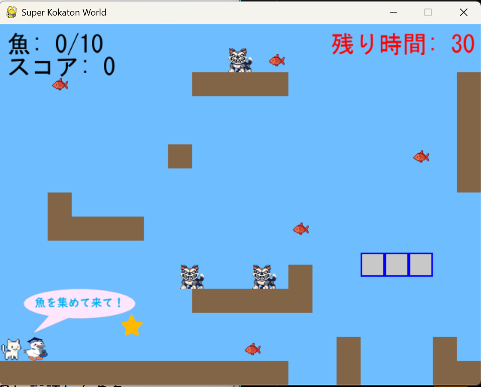

# スーパーこうかとんワールド64

## 実行環境の必要条件
* python >= 3.10
* pygame >= 2.1
* windows環境のみ（？）

## ゲームの概要
* 主人公キャラクターこうかとんをキーボード操作で魚を集めさせるゲームで，．．．
* 参考URL：[Python関連学習館](https://programming-mondai.com/top/pygame/e1/)

## ゲームの遊び方
* 矢印キーでこうかとんを操作し，スペースキー押下でジャンプする
* ESCキーで一時停止します。
* こうかとんが敵に触れる，穴に落ちた場合ゲームオーバーとなる
* 星を獲得したら無敵状態になります。
* 魚を5個獲得で2段ジャンプ可能。
* 魚5個以下の時リフトの上でジャンプできません。 
* クリア条件：魚10個獲得
* 制限時間：30秒
* 敵を倒すとスコア+100

## ゲームの実装
### 共通基本機能
* 背景画像と主人公キャラクターの描画、敵キャラクターの描画、魚の描画

### 分担追加機能
* 移動床を追加する（山本）
* ゲームオーバー時のスコア表示（堀江）
* 無敵になるアイテムを追加する(吉留)
* 一時停止(吉留)
* 時間制限を付ける(時間切れでゲームオーバー)（堀江）
* 魚を5個獲得しているとき2段ジャンプ可能(西勝)
* ゲーム中とジャンプ時にBGM追加(西勝)
* 画面の左上にスコアが表示される。(長島)
* 敵を倒したらスコアが追加される。(長島)

### ToDo
* 敵の種類を増やす(倒すと甲羅を落とす敵など)
* 中間地点を追加する
* ステージの追加(ボスステージなど)
* 難易度選択